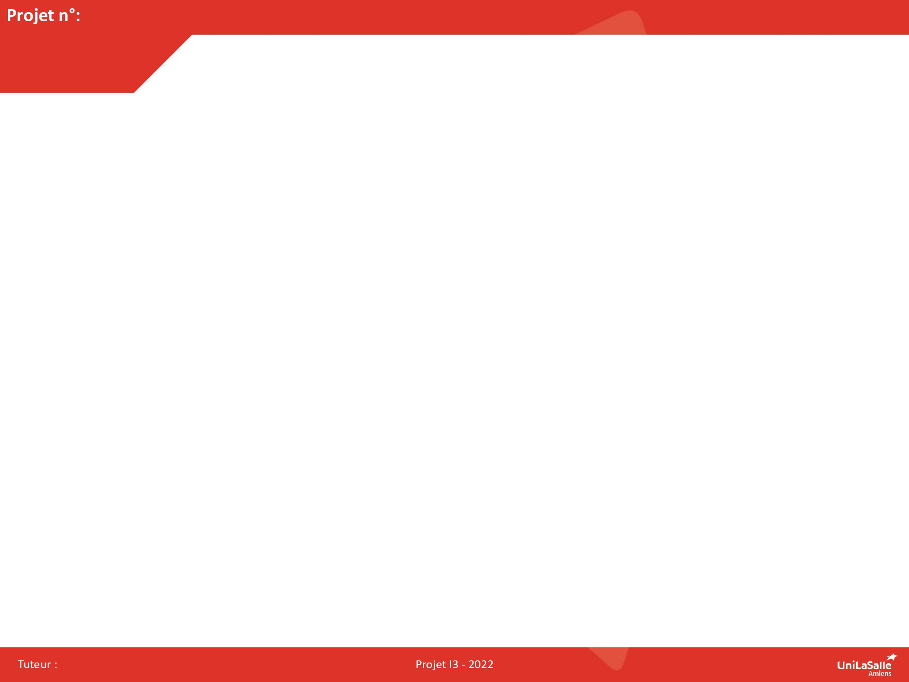

# Projet: PUZZLE BOT

Bienvenue dans la documentation de notre projet Puzzle Bot. Vous trouverez sur ce site toutes les informations nécessaires pour comprendre, utiliser et reproduire efficacement notre projet.

[Notre projet sur Onshape](https://cad.onshape.com/documents/2860ed3d58f1b518e6857770/w/82b3c0e474623135ccb76fa3/e/0cab16137cd459ee83ebe56e?renderMode=0&uiState=6936dc0e23fecc27d34268b2){: .btn .btn-primary .fs-5 .mb-4 .mb-md-0 .mr-2 }
[Notre repo GitHub](https://github.com/Makerspace-Amiens-2025-26/Puzzle-Bot-Groupe05){: .btn .fs-5 .mb-4 .mb-md-0 }

<iframe height="600" width="100%" src="https://modelembedder.net/embed?did=2860ed3d58f1b518e6857770&wvm=v&wvmid=6280fca954e7770df59e5a2f&eid=0cab16137cd459ee83ebe56e&elementType=ASSEMBLY" frameborder="0"></iframe>

<iframe height="600" width="100%" src="https://modelembedder.net/embed?did=1f8d508aa42a1f24d486347e&wvm=v&wvmid=97682665ed555c395ccb2db8&eid=d369a3de1c71a4ef5f42a4fe&elementType=PARTSTUDIO" frameborder="0"></iframe>

{: .warning }
>Pour intégrer la visualisation de votre projet Onshape, utilisez le site https://modelembedder.net . Activez le partage par lien via l'outil de partage de Onshape. n'oubliez pas d'activer l'option "export". Puis completez l'iframe ci-dessus avec le lien généré par le site https://modelembedder.net. Vous pouvez mettre à jour également le bouton avec le lien de partage de votre modèle.

## À propos du Projet

Inspiré des robots réalisés par [Mark Rober](https://www.youtube.com/watch?v=Sqr-PdVYhY4) et [Stuff Made Here](https://www.youtube.com/watch?v=WsPHBD5NsS0), ce projet vise à la création d'un robot autonome qui a pour but (comme son nom l'indique) la résolution de puzzle. 

Ce projet fait partie de notre formation d'ingénieur en énergie et numérique à Unilasalle Amiens. Cependant il est accessible à n'importe qui de par son côté ludique.

## Poster

Ici vous publierez le poster de votre projet.

## Vidéo

Ici vous publierez la vidéo de votre projet. 
- 1min30 au format vertical
- Présentation du projet 
- Des explication du fonctionnement du projet
- Des vues du projet / Prototype / Application etc... 
- Des plans du fonctionnement (même basique ou des éléments séparés)
- Une conclusion
- Si en stockage local : <50mo

<video src="images/intro_amiens.mp4" controls title="Title"  style="width: 100%;"></video>

---
