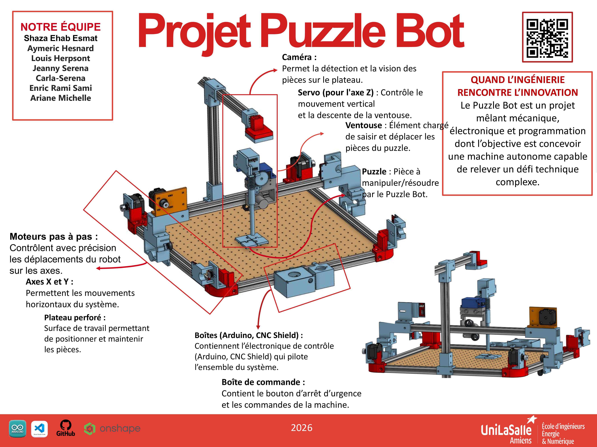

# Projet: PUZZLE BOT

Bienvenue dans la documentation de notre projet Puzzle Bot. Vous trouverez sur ce site toutes les informations nécessaires pour comprendre, utiliser et reproduire efficacement notre projet.

##  Description
Ce projet consiste en la conception d'une machine capable d'analyser, trier et assembler les pièces d'un puzzle de manière autonome.

[Notre projet sur Onshape](https://cad.onshape.com/documents/2860ed3d58f1b518e6857770/w/82b3c0e474623135ccb76fa3/e/0cab16137cd459ee83ebe56e?renderMode=0&uiState=6936dc0e23fecc27d34268b2){: .btn .btn-primary .fs-5 .mb-4 .mb-md-0 .mr-2 }
[Notre repo GitHub](https://github.com/Makerspace-Amiens-2025-26/Puzzle-Bot-Groupe05){: .btn .fs-5 .mb-4 .mb-md-0 }

## À propos du Projet

Inspiré des robots réalisés par [Mark Rober](https://www.youtube.com/watch?v=Sqr-PdVYhY4) et [Stuff Made Here](https://www.youtube.com/watch?v=WsPHBD5NsS0), ce projet vise à la création d'un robot autonome qui a pour but (comme son nom l'indique) la résolution de puzzle. 

Il fait partie de notre formation d'ingénieur en énergie et numérique à Unilasalle Amiens. Cependant il est accessible à n'importe qui de par son côté ludique.

## Poster

## Vidéo

<video src="images/presentation puzzle bot.mp4" controls title="PUZZLE BOT GROUPE 5"  style="width: 100%;"></video>

---
