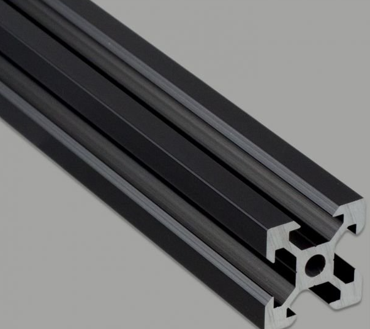
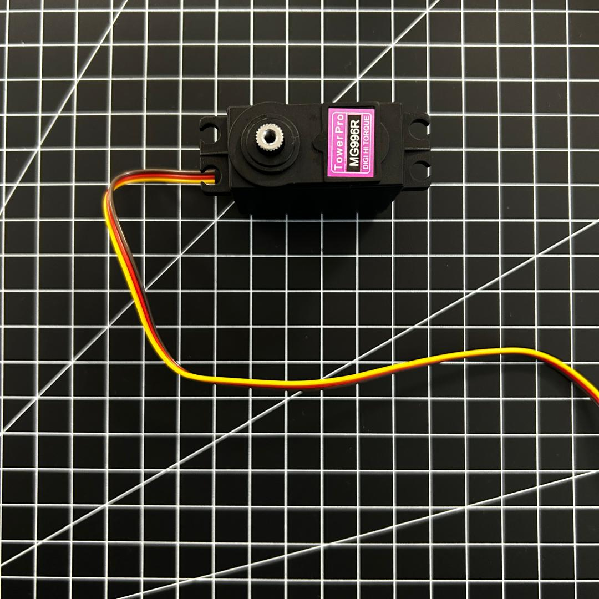
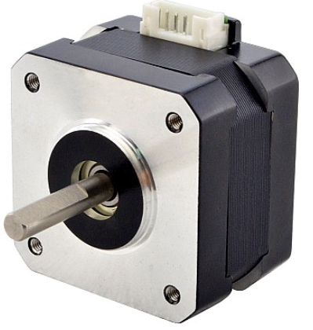
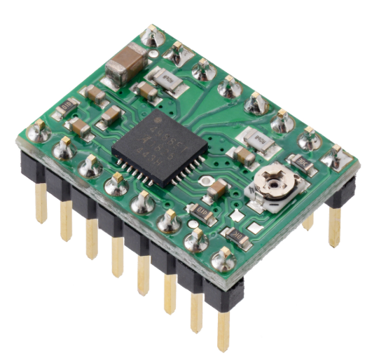
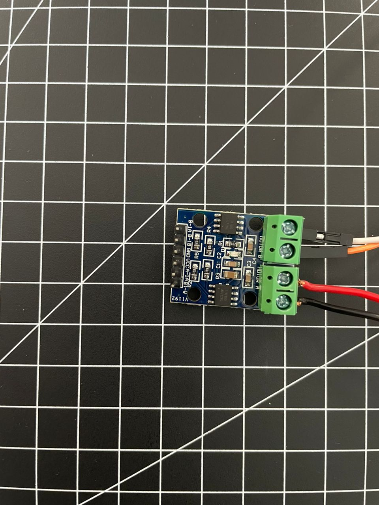
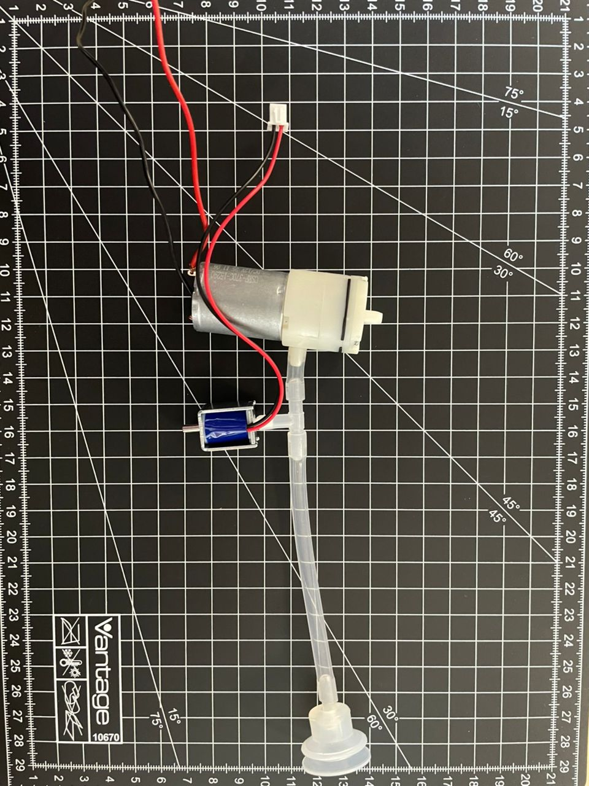

# Liste des Matériaux

- plateau
  
- profilés
  
  
- carte Arduino Uno
  
  
- Shield CNC

  
- servomoteur

  
- moteurs pas-à-pas

  
- driver pour les moteurs pas-à-pas

  
- MOSFET

  
- kit préhenseur pneumatique (pompe + electrovanne)

  
- interrupteurs fin de course

- interrupteurs d'urgence

  
- imprimantes 3d pour fabriquer des socles pour les autres matériaux

- courroies

- outils divers (pinces, tournevis, ...)

