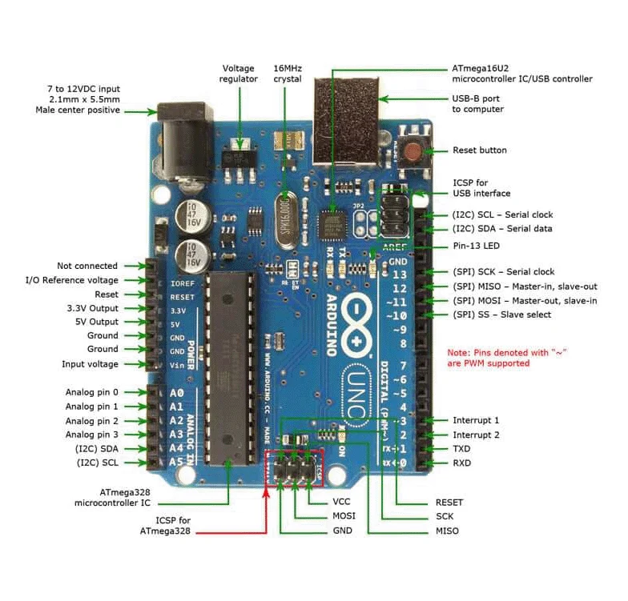
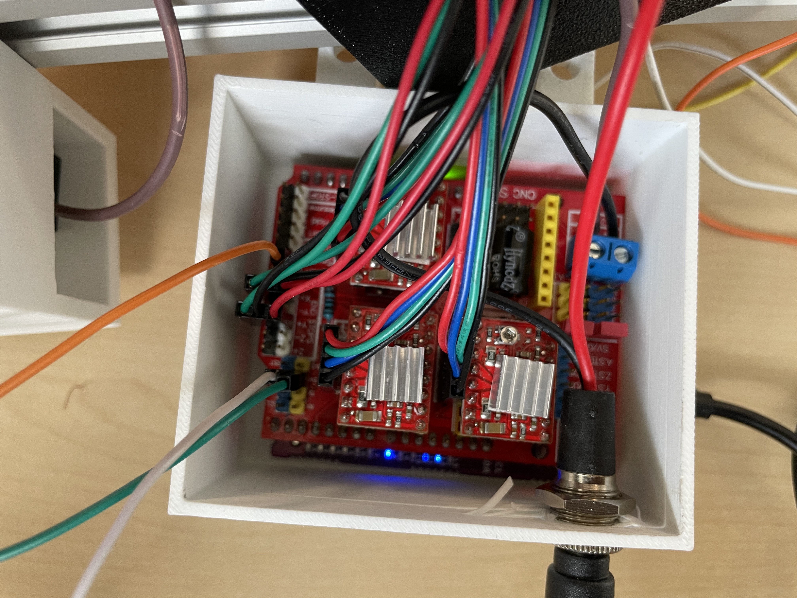

-Branchement des 3 moteurs pas à pas:

Explications:
Chaque moteur possède 4 fils dont:

* Les fils rouges et bleus sont étiquetés comme les connexions positives pour la bobine A et la bobine B respectivement,

* Le vert et le noir correspondent aux pôles négatifs de ces bobines respectivement.
  
Chaque module contrôle un moteur pas à pas (X,Y,A) sur la CNC Shield. Sachant que deux des moteurs sont placés sur l'axe X et un autre moteur sur l'axe Y. 

L'ordre des fils dépend du moteur, mais:
* Si le moteur vibre sans tourner alors les fils sont mal placés,
* Si le sens est inversé il faudra inverser les fils des moteurs,
* L'utilisation des jumpers nous permettent de dupliquer le signal du moteur pas à pas situé sur l'axe X vers l'axe A. 

-Branchement des interrupteurs fin course 

Un interrupteur est constitué de trois fils de couleurs distinctes : vert, rouge et noir. Dans le cadre de notre robot, nous utilisons deux interrupteurs de fin de course : l’un est installé sur l’axe X et l’autre sur l’axe Y.

L’interrupteur dédié à l’axe X est connecté à la broche X+ ainsi qu’à la masse (GND). De même, l’interrupteur positionné sur l’axe Y est relié à la broche Y+ et à la masse (GND).

Il est important de noter que seuls les fils rouge et noir sont utilisés pour le branchement : le fil rouge est connecté à l’alimentation (Vcc) tandis que le fil noir est relié à la masse (GND). Le fil vert n’est donc pas utilisé dans cette configuration.

-Branchement des servomoteurs :

Explications:

Chaque servomoteur possède 3 fils dont :
* La couleur jaune est reliée au 5V
* La couleur marron est reliée au GND
* La couleur rouge est reliée au Vcc
