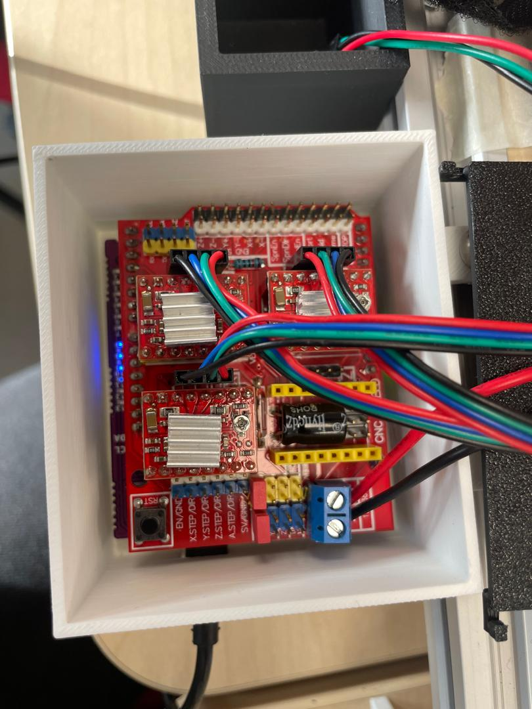

-Branchement des 3 moteurs pas à pas:

Explications:
Chaque moteur possède 4 fils dont:

* Les fils rouges et bleus sont étiquetés comme les connexions positives pour la bobine A et la bobine B respectivement,

* Le vert et le noir correspondent aux pôles négatifs de ces bobines respectivement.
  
Chaque module contrôle un moteur pas à pas (X,Y,A) sur la CNC Shield. Sachant que deux des moteurs sont placés sur l'axe X et un autre moteur sur l'axe Y. 

L'ordre des fils dépend du moteur, mais:
* Si le moteur vibre sans tourner alors les fils sont mal placés,
* Si le sens est inversé il faudra inverser les fils des moteurs,
* L'utilisation des jumpers nous permettent de dupliquer le signal du moteur pas à pas situé sur l'axe X vers l'axe A. 

