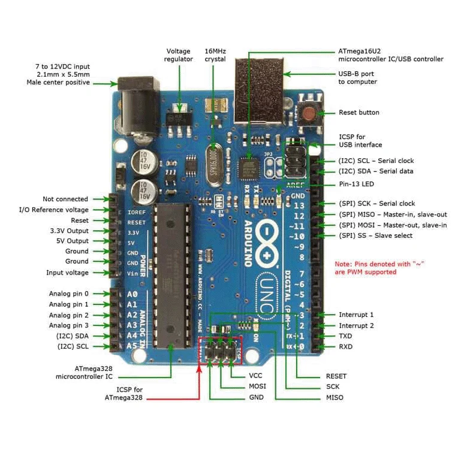
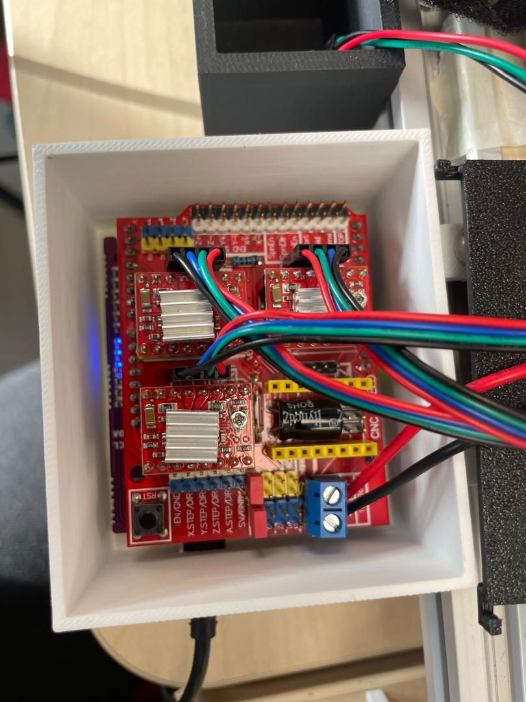
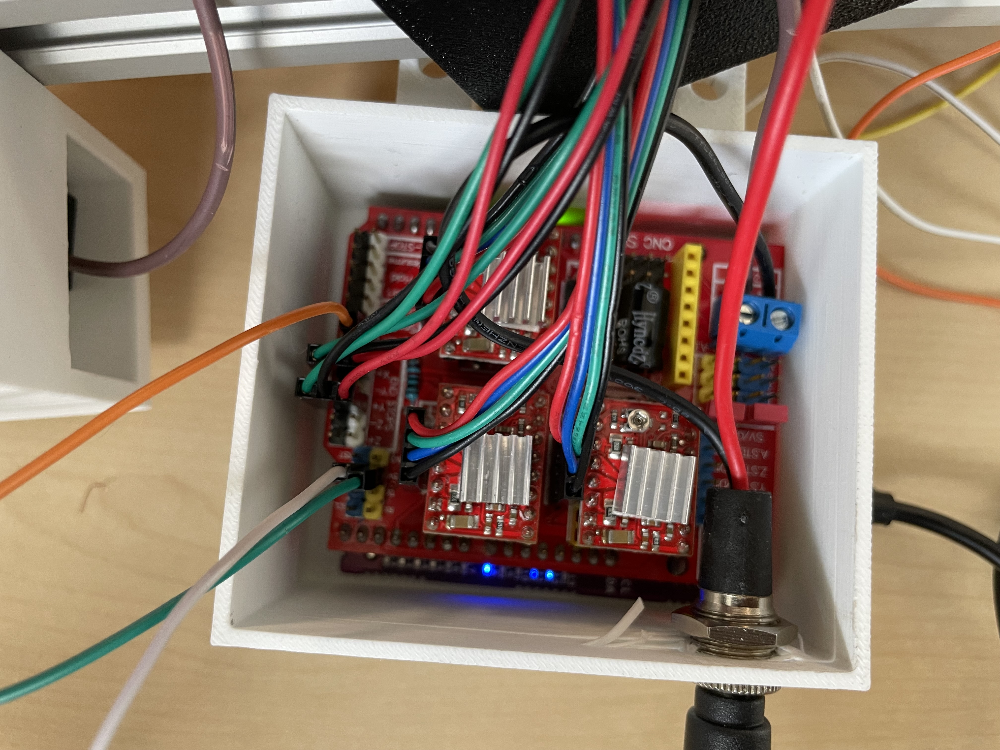
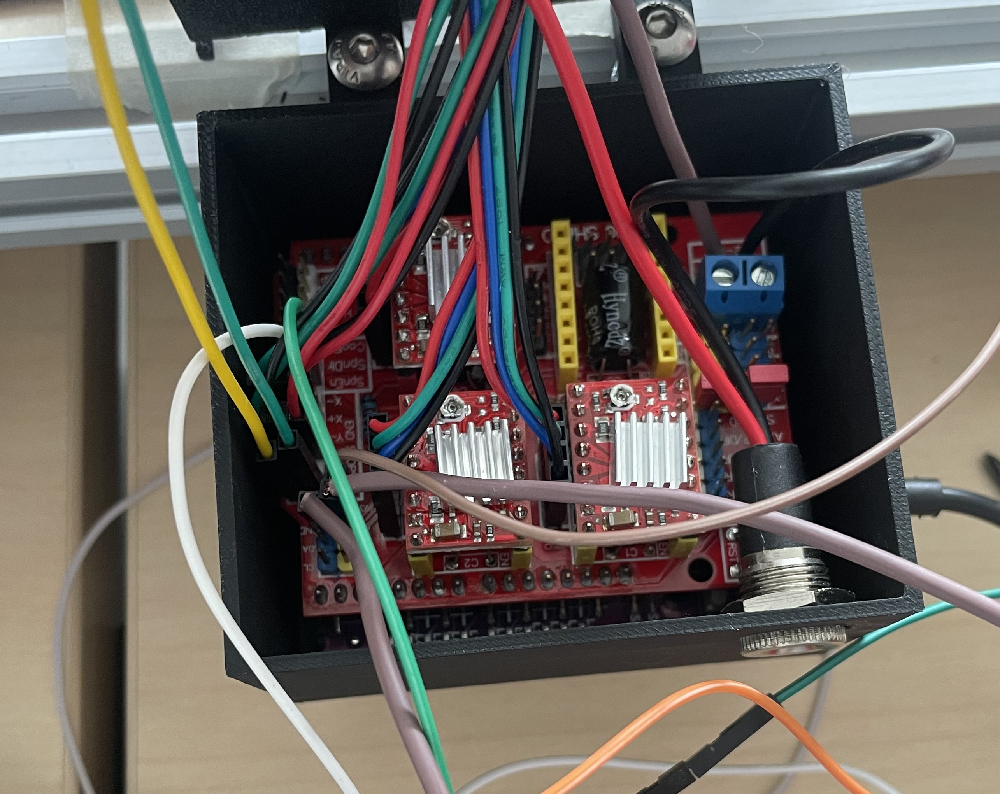
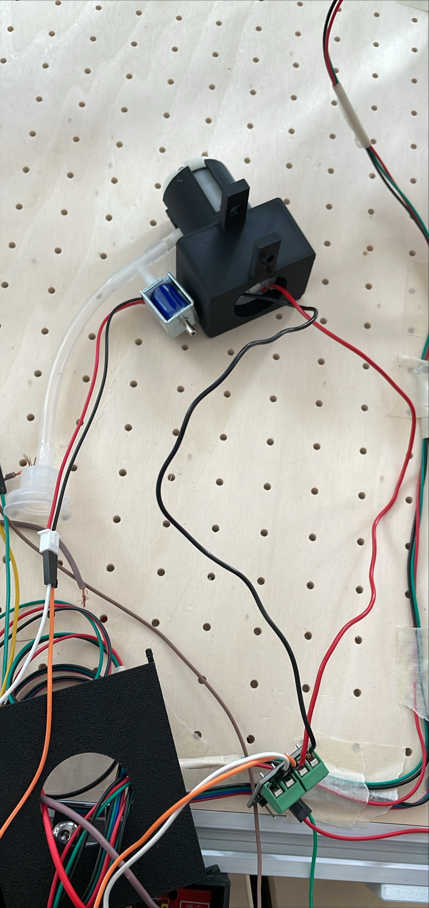
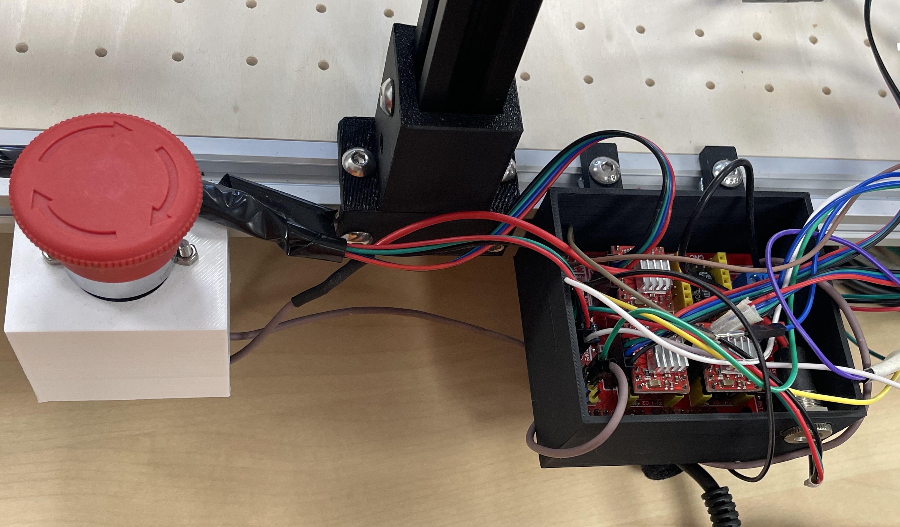

# Branchement des 3 moteurs pas à pas:

Explications:
Chaque moteur possède 4 fils dont:

* Les fils rouges et bleus sont étiquetés comme les connexions positives pour la bobine A et la bobine B respectivement,

* Le vert et le noir correspondent aux pôles négatifs de ces bobines respectivement.
  
Chaque module contrôle un moteur pas à pas (X,Y,A) sur la CNC Shield. Sachant que deux des moteurs sont placés sur l'axe X et un autre moteur sur l'axe Y. 

L'ordre des fils dépend du moteur, mais:
* Si le moteur vibre sans tourner alors les fils sont mal placés,
* Si le sens est inversé il faudra inverser les fils des moteurs,
* L'utilisation des jumpers nous permettent de dupliquer le signal du moteur pas à pas situé sur l'axe X vers l'axe A.

### Difficultés rencontrées: 
Comme problème nous avons eu au départ du mal à affecter les bons axes à nos 3 moteurs pas à pas. En effet, nous avons branché nos moteurs pas à pas respectivement sur les axes X, Y, Z. Après cela nous avons remarqué que nos moteurs n’étaient pas synchronisés. De ce fait, nous avons reçu l’information qu’il était possible de dupliquer le signal grâce à des Bridges. Ce qui nous a mené au branchement actuel.

# Branchement des interrupteurs fins de course 

Un interrupteur est constitué de trois fils de couleurs distinctes : vert, rouge et noir. Dans le cadre de notre robot, nous utilisons deux interrupteurs de fin de course : l’un est installé sur l’axe X et l’autre sur l’axe Y.

L’interrupteur dédié à l’axe X est connecté à la broche X+ ainsi qu’à la masse (GND). De même, l’interrupteur positionné sur l’axe Y est relié à la broche Y+ et à la masse (GND).

Il est important de noter que seuls les fils rouge et noir sont utilisés pour le branchement : le fil rouge est connecté à la broche (X+ ou Y+) tandis que le fil noir est relié à la masse (GND). Le fil vert n’est donc pas utilisé dans cette configuration. 

### Difficultés rencontrées:
La seule difficulté rencontrée concernait l’attribution des ports aux interrupteurs fins de course. Ce problème a toutefois été résolu très rapidement.  Car nous nous sommes rendu compte qu’il y avait des ports dédiés (cf. image du pin out Shield au début de ce document (la partie end stop)).

 #  Branchement des servomoteurs :

Explications :

Chaque servomoteur possède 3 fils dont :
* La couleur jaune est reliée sur une broche de la carte Arduino,
* La couleur marron est reliée au GND,
* La couleur rouge est reliée au Vcc.
  
### Diffucultés rencontrées :
Au tout début, nous ne savions pas où devait être connecté chaque fils de nos servomoteurs mais grâce à une bonne documentation nous avons trouvé la solution en un temps court. 

# Branchement de la pompe :
    
  
  
Au vu du fait que notre carte Arduino délivre une tension de 5v et que la pompe a besoin de 12v pour son fonctionnement. Nous avons utilisé un **MOSFET** pour contrer ce problème. Comme vous pouvez le voir sur l'image ci-dessous.

  
  
Nous avons premièrement fait un branchement entre les 2 fils de la pompe vers le MOSFET sur le **MOTOR 1** et un second branchement entre le MOSFET et les fils de la valve sur le **MOTOR 2**.
Les fils sortants du MOSFET (rouge et vert) sont respectivement branchés sur le VCC et une broche de la carte (SpnDlr).

### Difficultés rencontrées :
Le branchement de la pompe à été l’un des branchements les plus compliqués car vu que notre carte Arduino délivrait 5v et que nous avions besoin de 12v, nous avons dû faire appel à l’utilisation d’un MOSFET.
Or le MOFSET était un nouvel élément électronique que nous n’avions jamais utilisé au paravent et de ce fait, nous ne savions pas comment faire bon usage de ce petit appareil.  A l’aide d’un bon document et des enseignants nous avons pu régler ce problème.  

# Branchement du bouton d'arrêt d'urgence

 
Explications :

Le branchement du bouton d’arrêt d’urgence a été plus assez simple car il suffisait juste de :
De connecter deux fils sur le bouton d’arrêt sachant qu’un fils serait brancher sur l’alimentation qui alimente la carte Arduino et l’autre sur l’alimentation externe

# Difficultés rencontrées sur le câblage :

Tout d’abord, la gestion des fils dans un projet comme le nôtre est un sujet des plus complexes. Une bonne gestion des fils reflète à la fois de la beauté de notre projet, mais aussi de son génie.  En outre, la mauvaise gestion peut réduire la mobilité du robot, et nuire au champ de vision de notre caméra. 

Il nous a donc fallut trouver un moyen de regrouper les fils ensemble, de nous assurer de la bonne longueur des fils et de l’utilisation des bons fils. 
De ce fait, pour pallier ce problème, nous avons fait l’usage de scotch de plusieurs couleurs commençant par du blanc pour enfin terminer avec la couleur noire, nous avons également créer des pièces afin de contenir les fils (comme vous pouvez le voir ci-dessous), cependant cela n’a pas marché car ces dernières ont entravé le déplacement en se coinçant dans les coins de nos autres pièces et en se bloquant lorsqu’il n’y en avait pas assez.

Pour conclure, La gestion des fils est un sujet que nous aurions dû prendre en compte dès le début du projet plus précisément lors de la réalisation du plan de notre maquette.

De plus nous avons rencontré un souci concernant l’alimentation des moteurs. En effet la carte Arduino ne possède qu’une seule sortie 5v or nous avions besoin de plus pour alimenter les moteurs. Nous avons examiné plusieurs solutions la première était de rajouter un amplificateur à notre montage mais on n’en possédait pas ce qui était adapter. Nous avons donc utilisé la soudure comme solution. Ce n’était pas la meilleure solution car nous avons perdu en intensité de courant mais elle fonctionne plutôt bien. 

