Afin de faire communiquer les différents composants ensemble, il est nécessaire d'écrire des programmes que nous allons charger sur la carte Arduino.

Afin de nous aider dans notre tâche, nous utilisons dans notre projet plusieurs bibliothèques pour Arduino qui vont nous permettre de simplifier le code et faciliter la manipulation des composants.

Nous utilisons la bibliothèque [Accelstepper](https://www.airspayce.com/mikem/arduino/AccelStepper/) pour l'utilisation des moteurs pas-à-pas.

Les avantages de cette bibliothèque sont notamment:
* permet l'accélération/décélération et l'utilisation de vitesse très basse
* permet l'utilisation simultané de plusieurs moteur indépendant
* la plupart des fonctions ne sont pas bloquantes ce qui permet de réaliser des tâches en simultané
---
Nous utilisons la bibliothèque [Servo](https://docs.arduino.cc/libraries/servo/) pour l'utilisation des servomoteurs.

Les avantages de cette bibliothèque sont notamment:
* la création d'un objet pour les servomoteurs ce qui permet une utilisation simplifiée de ce dernier
* l'utilisation de plusieurs servomoteurs à la fois
* l'utilisation d'angle afin de donner des positions au moteur au lieu d'avoir à gérer les impulsions PWM

---
Choix des PINS 

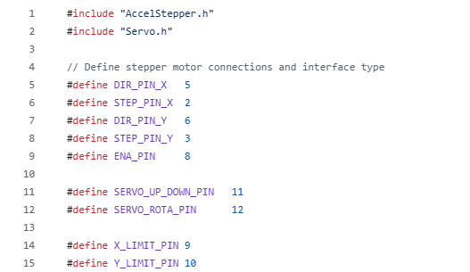</img>

Pour faire communiquer la carte Arduino avec les composants du Puzzle bot (Servomoteurs, bouton fin de course, etc) il est nécessaire de leur attribuer des PINS. Pour le choix de ces dernières, nous avons été limités par le Shield CNC. En effet, nous nous sommes référés à l'image suivante pour savoir lesquels étaient disponible.

</img>

Nous nous rendons donc compte que certaines broches sont réservées (par exemple la 8 pour le drive enable). Une fois que nous nous sommes rendu compte de cela, nous avons choisi arbitrairement selon nos besoins les numéros des broches que nous utilisons (par exemple la numéro 13 pour le moteur de la pompe).
Lors du developpement de cette partie , nous avons eu un conflit d'accès au port série. Au début, nous ne comprenions pas pourquoi notre script Python refusait systématiquement de se lancer alors que l'Arduino était bien branché. Le problème venait du fait que, le port COM est une ressource verrouillée par le système d'exploitation.Une fois que  l'IDE Arduino avec son moniteur série s'approprie le port pour communiquer, aucun autre programme ne peut y accéder simultanément.
Dès que nous lancions notre script, celui-ci essayait de forcer l'ouverture du port, ce qui provoquait une erreur.Pour pallier ce problème, nous avons fermer le moniteur série de l'IDE dès que nous avions fini de vérifier le fonctionnement de base du code Arduino. 

Setup
---

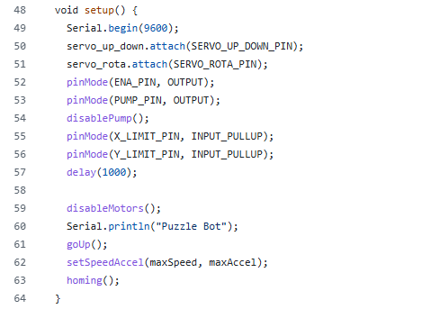</img>

Cette partie du code sert à l'initialisation des composants. Elle est propre à Arduino et est exécutée une seule fois lors de la mise sous tension de la carte. Nous nous en servons notamment pour relier les numéros des broches que nous avons choisi avec des variables afin de pouvoir manipuler les composants avec le code. Cette fonction nous permet aussi d'appeler la fonction homing qui sera expliqué un petit peu plus bas (pour faire cours, elle permet de déterminer la position initiale des moteurs pas-à-pas).

Activation des Moteurs et Pompes 
---
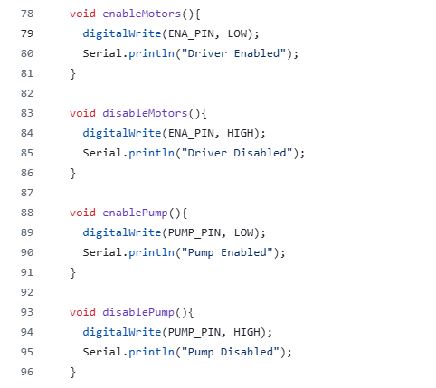</img>

Ces fonctions ont pour objectif respectif l'activation des moteurs et de la pompe. Comme vous pouvez les voir, nous utilisons la fonction pinMode dans chacun des cas. Cette fonction envoie pour consigne à la carte d'activer ou de désactiver une broche en fonction d'un état (respectivement HIGH et LOW). 

LimitPressed
---

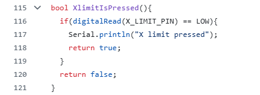</img>

Cette fonction permet à notre programme de détecter lorsque l'un des interrupteurs fins de course est actionné. Elle utilise la fonction digitalRead qui permet à Arduino de lire l'état d'un bouton soit HIGH (relâché) ou LOW (appuyé). Elle est notamment utilisé lors de la phase de HOMING qui permet de définir un système de coordonnée à nos moteurs stepper. Cette phase sera expliquée plus en détail dans la partie suivante du code. 

Homing
---
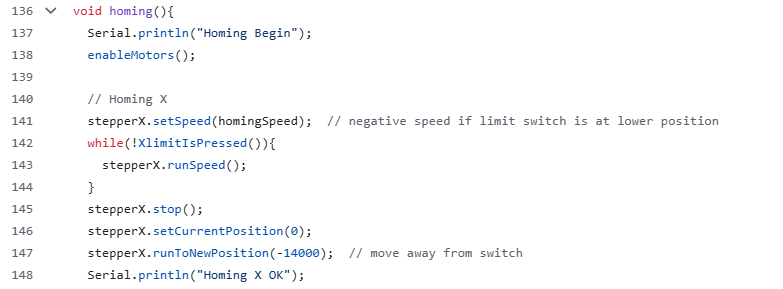</img>

L'algorithme de cette fonction est plutôt simple: Il va donner comme instruction aux moteurs d'aller en direction des interrupteurs fins de course jusqu'à les atteindre. Elle utilise deux fonctions de la bibliothèque AccelStepper: la fonction SetSpeed (il définit le sens en fonction du signe de la vitesse) couplée avec la fonction RunSpeed (qui lance le mouvement). Une fois l'interrupteur atteint, nous initialisons la position atteinte comme étant l'origine puis nous nous écartons du boutons (notez que le point visé est négatif, cela est dû à la façon dont nous avons monté les moteurs (En soit ne faites pas la même erreur que nous)). Nous exécutons cette fonction dans la partie Setup du programme (comme vous avez pu le voir précédemment) et permet de créer une sorte de système de coordonnées qui est à la base des déplacements. 

Dans cette partie, il arrivait souvent que le robot, au lieu de se diriger vers l'interrupteur pour initialiser son origine, s'en éloigne. Cela venait directement de la configuration de notre bibliothèque AccelStepper : nous avions défini une vitesse positive dans setSpeed(), mais en raison de la manière spécifique dont nous avions câblé les bobines des moteurs sur le CNC Shield, cette valeur positive correspondait en réalité à un mouvement vers l'extérieur. Le moteur ne « savait » pas où se trouvait l'origine ; il se contentait d'appliquer bêtement une instruction de rotation qui, par notre erreur de montage, l'éloignait toujours plus du point de contact souhaité.

Move To
---
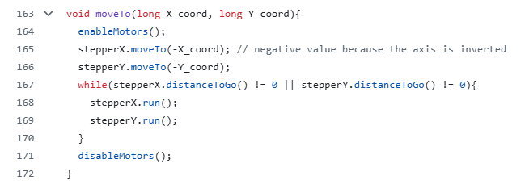</img>

Cette fonction va se servir du système de coordonnées définit grâce à la fonction Homing afin de faire déplacer le robot à une certaine position. 

***

Dans une seconde partie, nous avons intégré une caméra à notre projet, ayant pour but de détecter des marqueurs [Aruco](https://robotechnancy.github.io/Odometrie/OdometrieAbsolue/PresentationArUCO/). Cependant, il n'est pas facile de pouvoir analyser une image facilement avec Arduino. Nous avons donc pris la décision de complémenter notre projet avec l'utilisation d'un code python. Nous avons choisi ce langage car il possède de multiples bibliothèques qui sont utiles pour le traitement d'image et même pour la détection desdits marqueurs. Parmi ces bibliothèques, nous utilisons notamment [OpenCV](https://www.pythoniaformation.com/blog/tutoriels-python-par-categories/apprendre-la-computer-vision/opencv-bases-partie1) qui comme annoncé précédemment permet la capture et le traitement d'image à partir d'un code python (Vous pourrez trouver des exemples d'utilisation dans la partie projet de notre repo GitHub). 

Exemple d'utilisation du code read_aruco.py:

Image capturée:

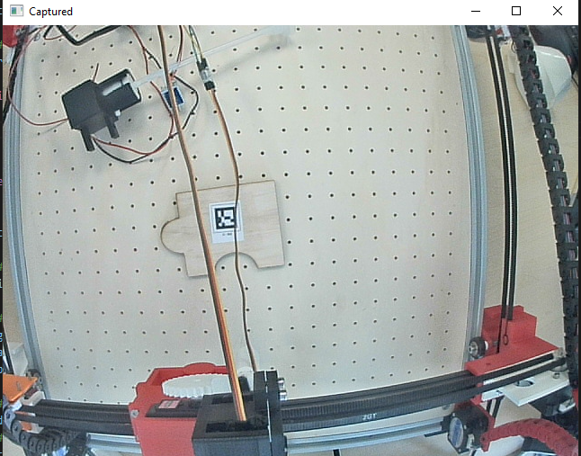</img>

Image après le traitement:

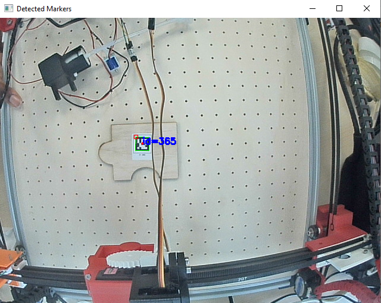</img>

Du point de vue de son fonctionnement, le code est relativement simple à comprendre car la majorité des fonctions ont des noms plutôt explicites.

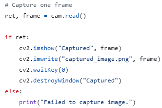</img>

Nous commençons par capturer une image (par exemple celle ci-dessus) avec la fonction read d'Opencv qui va, comme son nom l'indique, lire ce que la caméra enregistre. Les fonctions suivantes permettent de créer une fenêtre afin de visualiser l'image, puis d'attendre que l'utilisateur appuie sur une touche avant de détruire les fenêtres créées.

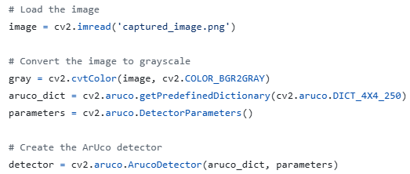</img>

Une fois l'image enregistré, nous lui appliquons un filtre (ici le filtre nuance de gris avec la fonction cvtcolor) afin de faciliter son traitement futur. Nous définissons également le dictionnaire Aruco que nous utilisons car ces derniers peuvent avoir différentes tailles ou formes.

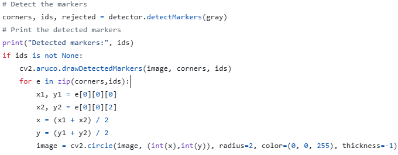</img>

Il ne reste plus qu'à détecter les marqueurs. Heureusement, OpenCV possède une fonction qui réalise ce travail (la fonction detectMarkers). Il s'agit donc de dessiner les marqueurs sur l'image et de rajouter un point qui marque le centre de ces derniers. Vous pouvez voir le rendu dans l'image ci-dessus.
